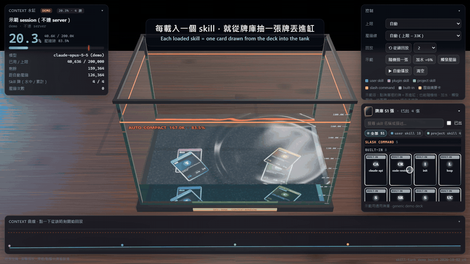
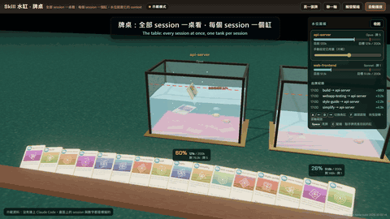
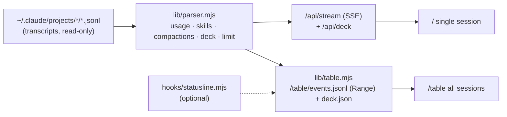

# skill-tank — Skill cards × Context aquarium for Claude Code

**English** | [繁體中文](README.zh-TW.md)

> Every time Claude Code loads a skill, a card is drawn from your deck and tossed into a glass tank.
> The water level is how full the context window is. When the water hits the red line, the tank overflows —
> that's auto-compaction: most cards get washed over the rim, and a golden summary card settles on the bottom.

<table>
<tr>
<td align="center"><b>Single session</b> · <code>/</code><br></td>
<td align="center"><b>Table — every session</b> · <code>/table</code><br></td>
</tr>
</table>

<p align="center"><a href="docs/media/skill-tank-demo.mp4">Watch the video (MP4)</a></p>

**Live demo:** <https://claude.ai/artifact/Wu4Ji88Un1RRmnfFDRnV2Q> — demo mode only (no server, nothing read from any machine; the cards there are generic examples). To see *your* sessions, run it locally (below).

skill-tank is a small local web app that turns the session transcripts Claude Code already writes to `~/.claude/projects` into a realistic three.js aquarium. No hooks to install, no npm dependencies, no changes to your Claude Code settings.

## Two views, one server

Every session is labelled **project · title** — the last folder of the session's working directory, then the title Claude Code generated for it (for example `my-app · Fix login bug`) — so you always know which project a tank belongs to.

| View | URL | What it is for |
|---|---|---|
| **Single session** | `/` (or `/?session=<id>`) | One session up close: a big tank, the **deck** of every skill this session can play, a context curve you can scrub, and replay from any moment. |
| **Table** | `/table` | Every active session at once: one tank per session on a felt card table, a hand of cards at the table edge, and a water-level panel. Click a tank's title to jump into its single-session view. |

### Single session

- The tank fills to `context used ÷ context limit`. Warm colors creep in as you approach the line.
- **The deck** (right side; a bottom drawer on phones) lists every skill the session can use, grouped by kind — your own skills, plugin skills, project skills, slash commands and built-ins. When a skill loads, its card is lifted out of its slot, flips, and splashes into the water. Played cards stay in the deck, dimmed, with a play counter.
- **Context curve** at the bottom: every dot is a skill load, every red line a compaction. Click anywhere to replay from there (1–16×).
- Hover or tap a card for details: when it loaded, how much context grew (Δ), an estimated token size, and its description.

### Table

- One tank per session that wrote to its transcript in the last `SKILL_TANK_IDLE_MIN` minutes (default 120). Sessions that go quiet drain away; new ones appear.
- Each tank has its own limit (200K or 1M) and its own red line, computed the same way as in the single view.
- Cards fly from the hand into the right tank as skills load; compactions overflow just like in the single view, and only the skills Claude Code re-injects after the compaction stay in the tank.

## How it reads Claude Code's transcripts

One parser (`lib/parser.mjs`) feeds both views. These are the facts it relies on — all checked against real transcripts:

| What | Where it comes from |
|---|---|
| **Context used** | Each main-chain assistant message's `usage`: `input_tokens + cache_creation_input_tokens + cache_read_input_tokens`. Lines that share a `requestId` are counted once; `isSidechain: true` (subagents) is ignored. It matches Claude Code's own `compactMetadata.preTokens` within 0.5%. |
| **A skill was loaded** | An assistant `tool_use` named `Skill`, followed by a meta user message that starts with `Base directory for this skill:` (and carries `sourceToolUseID`); or a user-typed `/command` (`<command-name>…</command-name>`) followed by the same kind of message. Built-in commands like `/clear` are followed by `system/local_command` instead and do not count. |
| **Compaction** | `{"type":"system","subtype":"compact_boundary","compactMetadata":{"trigger":"auto","preTokens":…,"postTokens":…}}`. A few lines later an `invoked_skills` attachment lists the skills re-injected after the compaction — those are the cards that stay. |
| **The deck** | The `skill_listing` attachment: the exact list of skills Claude Code shows the model (`isInitial: true` once, later deltas when skills are added). Descriptions are sometimes omitted when the list is over budget; they are filled in from each skill's `SKILL.md`. Sessions without a listing fall back to scanning `~/.claude/skills`, `~/.claude/commands`, enabled plugins and the project's `.claude/` folder. |
| **Context limit** | `message.model` never carries the `[1m]` suffix. The model attachment (`identity.modelId`, e.g. `claude-opus-…[1m]`) does; if it is there, or any turn went past 200K, the limit is 1M, otherwise 200K. You can override it in the UI. |
| **The red line** | **limit − 33K.** This is inferred from data, not from documentation: every auto-compaction observed fired at 167.3K–169.5K on 200K sessions and 967.4K–972.8K on 1M sessions — all within a few K above limit − 33K. So the line sits at 83.5% for 200K and 96.7% for 1M, not at 92%. |



## Run it

Requirements: **Node.js 18+**. Nothing to install.

```bash
git clone <this repo> && cd skill-tank
node server.mjs
# → http://127.0.0.1:4700/        single session
# → http://127.0.0.1:4700/table   all active sessions
```

On Windows, `start.bat` starts it with a hidden console window (log in `.runtime/server.log`) and `stop.bat` stops only the process that listens on the port and runs `server.mjs`.

| Environment variable | Default | Meaning |
|---|---|---|
| `SKILL_TANK_PORT` | `4700` | Port |
| `SKILL_TANK_HOST` | `127.0.0.1` | Bind address. Set `0.0.0.0` only on a trusted network (see Privacy). |
| `SKILL_TANK_ROOT` | `~/.claude/projects` | Transcript folders; several separated by `;` |
| `SKILL_TANK_IDLE_MIN` | `120` | Table: a session gets a tank while its transcript was written within this many minutes |
| `SKILL_TANK_EXTRA` | `./test-data` | Extra folders (shown as `[測試]` test sessions; used by the tests) |
| `SKILL_TANK_HOOK_EVENTS` | – | Optional hook mode, see below |

URL parameters for `/`: `?session=<id>` pin a session · `?demo` demo mode with **your own** skills as the deck · `?demo&auto` autoplay · `?cam=x,y,z,tx,ty,tz` fixed camera. `/table?demo` is the table's demo. Opening `index.html` straight from disk (`file://`) also gives demo mode; with no server there is no skill list, so it plays placeholder cards.

**This repo contains no skill list.** The deck is always built on your machine from your own skills.

## Privacy

- **Read-only.** The server only reads `~/.claude/projects` (and the `SKILL.md` files of your skills, for descriptions). It never writes there and never changes your settings.
- **Local by default.** It binds `127.0.0.1`. Setting `SKILL_TANK_HOST=0.0.0.0` exposes the pages to your network **without authentication**.
- **No conversation text on screen.** The pages show the folder name of each session, its auto-generated title (`ai-title`, which can hint at what the session is about), skill names and descriptions, token counts and timestamps. Message contents are never sent to the browser.
- No telemetry. The only external requests are three.js from jsDelivr and fonts from Google Fonts.

## Optional: hook mode

`hooks/` holds an alternative data source: Claude Code hooks plus a status line that append events to `~/.claude/context-tank/events.jsonl`. **You do not need it** — transcripts are enough. If you want the table to use the context-window size and usage that Claude Code's status line reports:

```bash
node hooks/install.mjs --statusline-only   # edits ~/.claude/settings.json (backs it up first)
SKILL_TANK_HOOK_EVENTS=1 node server.mjs
node hooks/install.mjs --uninstall         # restores your previous status line
```

Risks, plainly: it modifies `~/.claude/settings.json`; it runs a Node process for every status-line refresh (and, without `--statusline-only`, for several hook events); it only takes effect in sessions started after installing. The server merges **status lines only**; skills and compactions still come from the transcripts so nothing is counted twice. Your existing status line keeps working — it is chained in front.

## Tests

```bash
node tools/test-parser.mjs [file.jsonl] [--all]   # parser on real transcripts; --all re-checks the limit − 33K rule
npm i -D playwright-core                          # the browser checks drive an installed Google Chrome
node tools/verify.mjs          # single view: card count vs parser, live tail, demo compaction, replay
node tools/verify-deck.mjs     # deck: drawn from its slot, skill_listing deltas, phone drawer
node tools/verify-table.mjs    # table: tanks == active sessions, level vs parser (< 0.5 pp), live append, live compaction, phone
```

The checks pick transcripts on your machine (newest suitable session), copy one into `test-data/` and append fake events to the copy; your real transcripts are never modified. Screenshots go to `docs/shots/` (git-ignored — they contain your data).

## Limitations

- Main chain only: skills loaded inside subagents are not counted (they have their own context).
- The limit is 200K or 1M; anything else needs the manual override. The red line (limit − 33K) is empirical and may change with Claude Code versions.
- Δcontext is "next reply minus previous reply", so it includes everything else in that turn, not just the skill.
- The table polls (server tails active transcripts every 300 ms, the page polls every 500 ms): new cards show up 1–2 s after the line is written.
- Every card is its own canvas texture; the table's hand is capped at 16 cards.
- Phone layouts were checked in headless Chrome at 390×844 with touch emulation, not on real devices.
- Format facts were verified on Claude Code transcripts from 2026; a future format change can break the parser.

## License

MIT — see [LICENSE](LICENSE).
