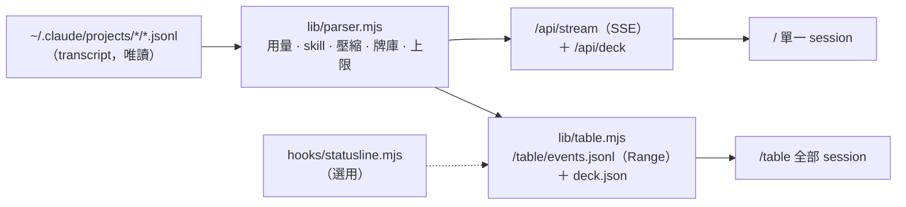

# skill-tank — Skill 卡牌 × Context 水缸（Claude Code）

[English](README.md) | **繁體中文**

> Claude Code 每載入一個 skill，就從你的牌庫抽出一張牌、丟進玻璃水缸。
> 水位就是 context 用了多少。水一碰到紅線就溢出缸緣——那就是自動壓縮：大部分的牌被沖走，
> 缸底留下一張金色的摘要卡。

<table>
<tr>
<td align="center"><b>單一 session</b> · <code>/</code><br></td>
<td align="center"><b>牌桌：全部 session</b> · <code>/table</code><br></td>
</tr>
</table>

<p align="center"><a href="docs/media/skill-tank-demo.mp4">看影片 (MP4)</a></p>

**線上試玩：** <https://claude.ai/artifact/Wu4Ji88Un1RRmnfFDRnV2Q> —— 只有示範模式（不連 server、不讀任何電腦上的資料，裡面的牌是通用範例）。要看**你自己的** session，請在本機跑（見下方）。

skill-tank 是一個本機小網頁：把 Claude Code 本來就會寫在 `~/.claude/projects` 的 session 紀錄（transcript），畫成 three.js 的寫實魚缸。不用裝 hook、沒有 npm 相依套件、不動你的 Claude Code 設定。

## 兩個畫面，一個 server

每個 session 都標成 **專案 · 標題**——session 工作目錄的最後一層資料夾，加上 Claude Code 替它產生的標題（例如 `my-app · Fix login bug`）——一眼就知道那個缸是哪個專案的。

| 畫面 | 網址 | 用途 |
|---|---|---|
| **單一 session** | `/`（或 `/?session=<id>`） | 一個 session 深入看：大水缸、這個 session 能用的**整副牌庫**、可以拖拉的 context 曲線、從任何時刻回放。 |
| **牌桌** | `/table` | 所有活躍 session 一桌看：每個 session 一個缸擺在牌桌上、桌緣一把手牌、水位面板。點缸上的標題就跳到它的單一畫面。 |

### 單一 session

- 水位＝已用 context ÷ 上限。越接近紅線，水色越往暖色走。
- **牌庫**（右側；手機是底部抽屜）列出這個 session 能用的每個 skill，依類別分組：你自己的 skill、plugin skill、專案 skill、slash 指令、內建。載入哪個 skill，那張牌就從格子被抽起、翻面、濺進水裡。出過的牌留在牌庫裡變暗，角標記出牌次數。
- 下方 **Context 曲線**：彩色點＝skill 載入，紅線＝壓縮。點任何一處就從那裡開始回放（1–16 倍速）。
- 滑過或點一下卡牌看詳情：何時載入、context 增加多少（Δ）、估計 token、描述。

### 牌桌

- 最近 `SKILL_TANK_IDLE_MIN` 分鐘（預設 120）內有寫入 transcript 的 session 各有一個缸；安靜下來的會退場，新開的會出現。
- 每個缸有自己的上限（200K 或 1M）和自己的紅線，算法跟單一畫面完全一樣。
- skill 載入時，牌從手牌飛進對應的缸；壓縮一樣會溢出，而且只有 Claude Code 壓縮後重新注入的 skill 會留在缸裡。

## 它怎麼「讀懂」Claude Code 的 transcript

兩個畫面共用同一個解析器（`lib/parser.mjs`）。下面是它依據的格式事實，全部用真實 transcript 驗證過：

| 什麼 | 從哪裡來 |
|---|---|
| **已用 context** | 主鏈每則 assistant 訊息的 `usage`：`input_tokens + cache_creation_input_tokens + cache_read_input_tokens`。同一個 `requestId` 被拆成多行只算一次；`isSidechain: true`（subagent）不算。跟 Claude Code 自己記的 `compactMetadata.preTokens` 差距在 0.5% 以內。 |
| **載入了一個 skill** | assistant 的 `tool_use`（name 是 `Skill`），接著一則以 `Base directory for this skill:` 開頭的 meta user 訊息（帶 `sourceToolUseID`）；或使用者打的 `/指令`（`<command-name>…</command-name>`）後面接同樣的訊息。`/clear` 這類內建指令後面接的是 `system/local_command`，不算牌。 |
| **壓縮** | `{"type":"system","subtype":"compact_boundary","compactMetadata":{"trigger":"auto","preTokens":…,"postTokens":…}}`。幾行之後的 `invoked_skills` attachment 列出壓縮後重新注入的 skill——那些就是留下來的牌。 |
| **牌庫** | `skill_listing` attachment：Claude Code 實際給模型看的 skill 清單（`isInitial: true` 一次，之後新增 skill 會有增量）。清單超過預算時描述會被省略，就從各 skill 的 `SKILL.md` 補。沒有清單的舊 session 改掃 `~/.claude/skills`、`~/.claude/commands`、已啟用的 plugin 與專案的 `.claude/` 資料夾。 |
| **上限** | `message.model` 永遠不帶 `[1m]`；帶 `[1m]` 的是 model attachment 的 `identity.modelId`（例如 `claude-opus-…[1m]`）。有它、或任何一輪超過 200K，上限就是 1M，否則 200K。介面上可以手動覆寫。 |
| **紅線** | **上限 − 33K。** 這是從數據反推的，**不是官方文件**：觀察到的每一次自動壓縮，200K 的 session 都發生在 167.3K–169.5K、1M 的在 967.4K–972.8K，全都落在「上限 − 33K」之上幾 K 以內。所以 200K 的紅線在 83.5%、1M 在 96.7%，不是 92%。 |



## 怎麼跑

需求：**Node.js 18 以上**。不用安裝任何東西。

```bash
git clone <這個 repo> && cd skill-tank
node server.mjs
# → http://127.0.0.1:4700/        單一 session
# → http://127.0.0.1:4700/table   全部活躍 session
```

Windows 可以用 `start.bat`（隱藏視窗啟動，log 在 `.runtime/server.log`）和 `stop.bat`（只停「在該 port 聽、而且跑 `server.mjs`」的那個 process）。

| 環境變數 | 預設 | 說明 |
|---|---|---|
| `SKILL_TANK_PORT` | `4700` | port |
| `SKILL_TANK_HOST` | `127.0.0.1` | 綁定位址。只有在信任的網路才設 `0.0.0.0`（見「隱私」）。 |
| `SKILL_TANK_ROOT` | `~/.claude/projects` | transcript 資料夾；多個用 `;` 分隔 |
| `SKILL_TANK_IDLE_MIN` | `120` | 牌桌：transcript 在幾分鐘內有寫入才有缸 |
| `SKILL_TANK_EXTRA` | `./test-data` | 額外資料夾（標成 `[測試]`，測試工具用） |
| `SKILL_TANK_HOOK_EVENTS` | – | 選用的 hook 模式，見下方 |

`/` 的網址參數：`?session=<id>` 固定某個 session · `?demo` 示範模式，牌庫用**你自己的** skill · `?demo&auto` 自動播放 · `?cam=x,y,z,tx,ty,tz` 固定鏡頭。`/table?demo` 是牌桌的示範模式。直接用瀏覽器開 `index.html`（`file://`）也是示範模式；沒有 server 就沒有 skill 清單，會用佔位牌。

**這個 repo 不含任何 skill 清單。** 牌庫永遠是在你的電腦上、用你自己的 skill 組出來的。

## 隱私

- **唯讀。** server 只讀 `~/.claude/projects`（以及你的 skill 的 `SKILL.md`，用來補描述），不會寫入，也不會改你的設定。
- **預設只給本機。** 綁 `127.0.0.1`。設 `SKILL_TANK_HOST=0.0.0.0` 會把頁面開給整個網路，**而且沒有驗證**。
- **畫面上沒有對話內容。** 頁面只顯示每個 session 的資料夾名、自動產生的標題（`ai-title`，可能透露 session 在做什麼）、skill 名稱與描述、token 數與時間。訊息內容從不送到瀏覽器。
- 沒有遙測。唯一的外部請求是從 jsDelivr 載 three.js、從 Google Fonts 載字型。

## 選用：hook 模式

`hooks/` 是另一種資料來源：Claude Code hook 加上一個 status line，把事件寫到 `~/.claude/context-tank/events.jsonl`。**一般不需要**——transcript 就夠了。如果想讓牌桌用 Claude Code status line 回報的上限與用量：

```bash
node hooks/install.mjs --statusline-only   # 會修改 ~/.claude/settings.json（先自動備份）
SKILL_TANK_HOOK_EVENTS=1 node server.mjs
node hooks/install.mjs --uninstall         # 還原你原本的 status line
```

風險說清楚：它會改 `~/.claude/settings.json`；每次 status line 更新都會跑一個 Node process（不加 `--statusline-only` 的話，好幾種 hook 事件也會）；只對安裝之後新開的 session 生效。server **只合併 status line**；skill 和壓縮仍以 transcript 為準，不會重複計算。你原本的 status line 會保留，串在前面顯示。

## 測試

```bash
node tools/test-parser.mjs [file.jsonl] [--all]   # 用真實 transcript 測解析器；--all 重驗「上限 − 33K」
npm i -D playwright-core                          # 瀏覽器測試會開本機安裝的 Google Chrome
node tools/verify.mjs          # 單一畫面：牌數 vs 解析器、即時 tail、示範壓縮、回放
node tools/verify-deck.mjs     # 牌庫：從格子抽牌、skill_listing 增量、手機抽屜
node tools/verify-table.mjs    # 牌桌：缸數＝活躍 session、水位 vs 解析器（< 0.5 個百分點）、即時 append、即時壓縮、手機
```

測試會在你的電腦上挑合適的 transcript（最新的那個），複製一份到 `test-data/`，只對副本 append 假事件；你真正的 transcript 不會被改。截圖存在 `docs/shots/`（已列入 .gitignore——裡面是你的資料）。

## 限制

- 只看主鏈：subagent 裡載入的 skill 不算（它們有自己的 context）。
- 上限只分 200K／1M，其他請手動覆寫。紅線（上限 − 33K）是經驗值，Claude Code 改版可能會變。
- Δcontext 是「下一則回覆減上一則回覆」，包含那一輪的其他內容，不只是 skill 本身。
- 牌桌是輪詢（server 每 300 ms tail 活躍 transcript、頁面每 500 ms 輪詢）：寫入後 1–2 秒新牌才出現。
- 每張牌是獨立的 canvas texture；牌桌的手牌最多 16 張。
- 手機版只在無頭 Chrome 390×844 觸控模擬驗過，沒有實機。
- 格式事實是用 2026 年的 Claude Code transcript 驗證的；之後格式若改變，解析器可能要跟著改。

## 授權

MIT——見 [LICENSE](LICENSE)。
